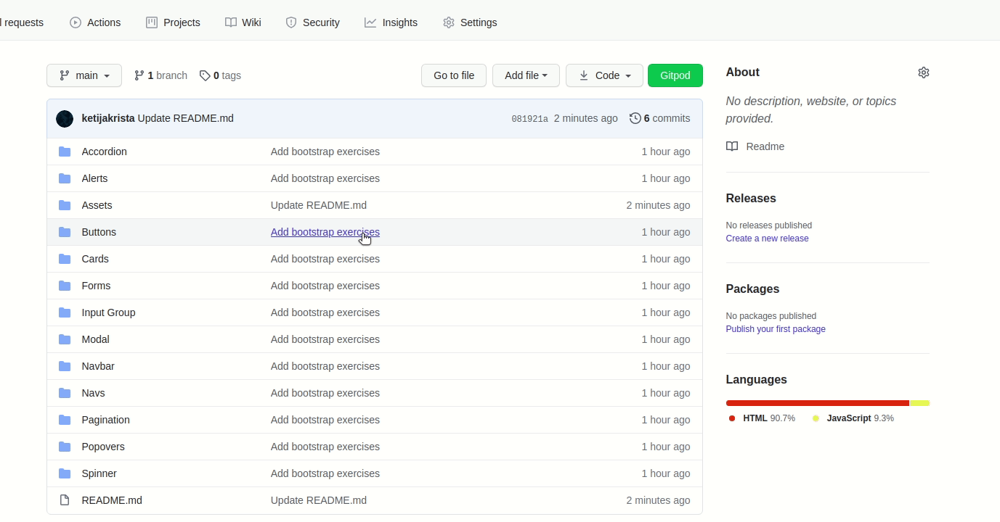

# Bootstrap exercises

In these exercises you will learn how to make use of pre-built HTML and CSS templates for UI interface elements such as buttons and forms.

Your task is to add Bootstrap to each `index.html` file and following the designs from the provided figma file create beautiful components by using Bootstrap templates.

## What is Bootstrap?

Bootstrap is a powerful toolkit - a collection of HTML, CSS, and JavaScript tools for creating and building web pages and web applications. It's open-source and free to use.

[Read more...](https://careerfoundry.com/en/blog/web-development/what-is-bootstrap-a-beginners-guide/)

## How to add Bootstrap to your project?

There are several ways of how to add Bootstrap, but for the purposes of this task, just follow the steps below:

1. Add this link element between `<head></head>` tags in your `index.html` file

`    <link
      href="https://cdn.jsdelivr.net/npm/bootstrap@5.0.0-beta1/dist/css/bootstrap.min.css"
      rel="stylesheet"
      integrity="sha384-giJF6kkoqNQ00vy+HMDP7azOuL0xtbfIcaT9wjKHr8RbDVddVHyTfAAsrekwKmP1"
      crossorigin="anonymous"
    />`
    
2. Add this script at the end inside `<body></body>` tags in your `index.html` file

`    `
    
[Read more...](https://getbootstrap.com/docs/5.0/getting-started/introduction/)
    
## How to use Bootstrap?

[Learn Bootstrap in 5 minutes](https://www.youtube.com/watch?v=nBoHOe4oJLc&ab_channel=AmruthPillai)

All you have to do is find the desired elements in the sidebar of [Docs](https://getbootstrap.com/docs/5.0/getting-started/introduction/) (check out Components) and copy paste them in your project. If some elements need additional styling, do that in `styles.css` files.

## How to access figma files?

1. Create a profile in [figma.com](figma.com).
2. Download the provided `.fig` files from `Assets` directory.

3. Add the downloaded `.fig` files to your `Drafts` in the figma homepage. 

    [Importing files into Figma](https://help.figma.com/hc/en-us/articles/360041003114-Import-files-into-Figma)

4. Open the files from `Drafts`.

## How to get styles from figma

## How to find elements in Bootstrap documentation

